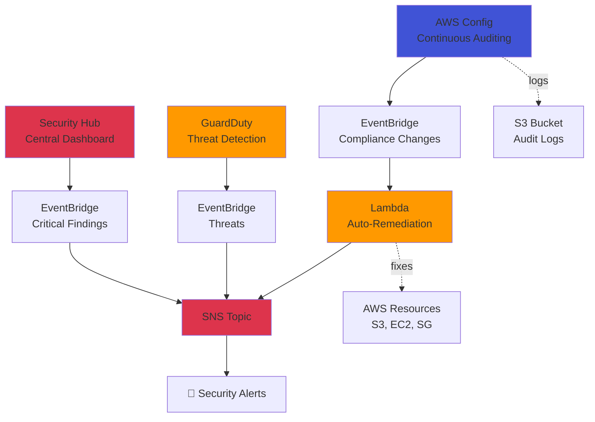

[](https://www.terraform.io/)
[](https://aws.amazon.com/)
[](https://www.python.org/)
[](https://www.cisecurity.org/)
[](https://www.cisecurity.org/cis-benchmarks/)
[](LICENSE)

# AWS Security Hardening & Compliance Framework

Automated security monitoring, threat detection, and compliance auditing system for AWS environments.

## 📋 Description

Enterprise-grade security framework that continuously monitors AWS infrastructure against CIS Benchmark standards, detects threats in real-time, and automatically remediates security issues.

**Key Features:**
- ✅ Continuous compliance monitoring against CIS AWS Foundations Benchmark
- ✅ Real-time threat detection with GuardDuty
- ✅ Automated security remediation with Lambda
- ✅ Centralized security dashboard with Security Hub
- ✅ Instant alerts for critical security findings
- ✅ 100% Infrastructure as Code with Terraform

## 🏗️ Architecture


## 🔒 Components

### AWS Config
**Purpose:** Continuous configuration monitoring and compliance auditing

**What it does:**
- Records all AWS resource configuration changes
- Evaluates resources against security rules every 10-15 minutes
- Stores complete audit trail in S3

**Implemented Rules (CIS Benchmark):**
1. **S3 Bucket Encryption** - All S3 buckets must have server-side encryption enabled
2. **Root Account MFA** - AWS root account must have MFA enabled
3. **IAM Password Policy** - Enforce strong password requirements (14+ chars, complexity)
4. **EBS Volume Encryption** - All EBS volumes must be encrypted
5. **Restricted SSH Access** - Security Groups must not allow SSH (port 22) from 0.0.0.0/0

### Security Hub
**Purpose:** Centralized security findings dashboard

**Features:**
- Aggregates findings from Config, GuardDuty, Inspector, and other AWS security services
- Applies industry security standards:
  - **CIS AWS Foundations Benchmark v1.4.0**
  - **AWS Foundational Security Best Practices**
- Assigns severity levels: CRITICAL, HIGH, MEDIUM, LOW
- Filters and prioritizes critical security issues

### GuardDuty
**Purpose:** Intelligent threat detection service

**Analyzes:**
- CloudTrail event logs (API activity)
- VPC Flow Logs (network traffic)
- DNS query logs

**Detects:**
- 🚨 Compromised EC2 instances (cryptocurrency mining, botnet activity)
- 🚨 Stolen IAM credentials used from suspicious IPs
- 🚨 Unauthorized S3 bucket access
- 🚨 Port scanning and reconnaissance activity
- 🚨 Communication with known malicious domains

### Auto-Remediation Lambda
**Purpose:** Automated security issue remediation

**Triggers:** EventBridge event when Config detects NON_COMPLIANT resource

**Remediation Actions:**

| Security Issue | Automated Fix |
|---------------|---------------|
| **S3 without encryption** | Enable AES256 server-side encryption |
| **Unencrypted EBS volume** | Create encrypted snapshot + notify |
| **Open SSH Security Group** | Remove 0.0.0.0/0 ingress rule |

**Safety Feature:** `enable_auto_remediation` variable (default: false)
- `false`: Logs what would be fixed (dry-run mode)
- `true`: Actually applies fixes automatically

### SNS Notifications
**Purpose:** Real-time security alerting

**Alert Sources:**
- Config compliance changes
- Security Hub CRITICAL/HIGH findings
- GuardDuty threat detections
- Lambda remediation reports

**Alert Format:**
```
🚨 SECURITY ALERT

Service: GuardDuty
Severity: HIGH
Finding: UnauthorizedAccess:EC2/SSHBruteForce
Resource: i-0abc123def456
Description: EC2 instance under SSH brute force attack from 203.0.113.42

Action Required: Investigate immediately
```

## 📊 CIS Benchmark Compliance

**What is CIS Benchmark?**

The **Center for Internet Security (CIS) AWS Foundations Benchmark** is an industry-recognized security standard with ~140 controls defining how to securely configure AWS environments.

**Why it matters:**
- Required for compliance in regulated industries (finance, healthcare, government)
- Used in security audits and assessments
- Demonstrates security best practices to clients and stakeholders
- Common requirement in enterprise RFPs

**Our Implementation:**
This project implements 5 critical CIS controls as AWS Config rules, providing automated continuous monitoring and enforcement.

## 🚀 Deployment

### Prerequisites
```bash
# Terraform >= 1.0
terraform version

# AWS CLI configured
aws sts get-caller-identity

# Python 3.11+
python3 --version
```

### Installation

**1. Clone repository:**
```bash
git clone <repo-url>
cd security-hardening
```

**2. Configure email for alerts:**

Edit `variables.tf` line 25:
```hcl
variable "alert_email" {
  default = "your@email.com"  # ← Change here
}
```

**3. Package Lambda function:**
```bash
zip lambda_remediation.zip lambda_remediation.py
```

**4. Deploy infrastructure:**
```bash
terraform init
terraform plan
terraform apply
```

**5. Confirm SNS subscription:**
- Check email inbox/spam
- Click "Confirm subscription" in AWS SNS email

**6. Verify deployment:**
```bash
# Check Security Hub
aws securityhub describe-hub --region us-east-1

# Check GuardDuty
aws guardduty list-detectors --region us-east-1

# Check Config
aws configservice describe-configuration-recorders --region us-east-1

# View compliance status
aws configservice describe-compliance-by-config-rule --region us-east-1
```

## 🧪 Testing

### Create Non-Compliant Resource

**Test 1: S3 bucket without encryption**
```bash
aws s3api create-bucket \
  --bucket test-security-$(date +%s) \
  --region us-east-1
```

**Expected behavior:**
1. Config detects non-compliant bucket (~5-10 min)
2. EventBridge triggers Lambda
3. Lambda logs remediation action
4. Email alert received

**Test 2: Security Group with open SSH**
```bash
# Create security group
aws ec2 create-security-group \
  --group-name test-open-ssh \
  --description "Test insecure SG" \
  --region us-east-1

# Add dangerous SSH rule
aws ec2 authorize-security-group-ingress \
  --group-name test-open-ssh \
  --protocol tcp \
  --port 22 \
  --cidr 0.0.0.0/0 \
  --region us-east-1
```

**Expected behavior:**
1. Config detects NON_COMPLIANT (~10 min)
2. Lambda removes dangerous rule (if auto-remediation enabled)
3. Email notification sent

### Monitor Lambda Execution
```bash
# View real-time logs
aws logs tail /aws/lambda/security-hardening-auto-remediation \
  --follow --region us-east-1
```

**Example log output:**
```
🔧 Auto-remediation triggered
⚠️  NON_COMPLIANT: s3-bucket-server-side-encryption-enabled - test-bucket-123
🔒 AUTO_REMEDIATE disabled - would encrypt bucket: test-bucket-123
```

### Enable Auto-Remediation

**Edit `variables.tf`:**
```hcl
variable "enable_auto_remediation" {
  default = true  # ← Change to true
}
```

**Apply changes:**
```bash
terraform apply
```

Now Lambda will actually fix security issues automatically.

## 💰 Cost Estimate

| Service | Usage | Monthly Cost |
|---------|-------|--------------|
| AWS Config | 5 rules + recorder | $2.00 |
| Security Hub | 2 standards enabled | $1.50 |
| GuardDuty | Continuous monitoring | $1-3.00 |
| Lambda | ~50 invocations/month | $0.00 (free tier) |
| SNS | ~50 emails/month | $0.00 (free tier) |
| S3 | Config logs storage | $0.50 |
| CloudWatch Logs | 7-day retention | $0.50 |
| **TOTAL** | | **~$5-8/month** |

**Note:** Costs vary based on:
- Number of AWS resources monitored
- Frequency of compliance changes
- GuardDuty data volume analyzed

## 🔐 Security Features

- ✅ **Least privilege IAM roles** - Lambda and Config have minimal required permissions
- ✅ **Encrypted storage** - SNS topic uses AWS managed encryption
- ✅ **Audit trail** - Complete configuration history in S3
- ✅ **Immutable logs** - Config logs cannot be deleted without detection
- ✅ **Defense in depth** - Multiple security layers (Config + GuardDuty + Security Hub)
- ✅ **Automated response** - Reduces time-to-remediation from hours to seconds

## 🎯 Skills Demonstrated

### Cloud Security
- ✅ AWS Config (compliance as code)
- ✅ Security Hub (centralized security management)
- ✅ GuardDuty (threat detection)
- ✅ CIS Benchmark implementation
- ✅ Security automation

### DevSecOps
- ✅ Infrastructure as Code (Terraform)
- ✅ Automated remediation (Lambda)
- ✅ Event-driven security (EventBridge)
- ✅ Security monitoring & alerting

### Compliance & Governance
- ✅ CIS AWS Foundations Benchmark
- ✅ AWS Foundational Security Best Practices
- ✅ Continuous compliance monitoring
- ✅ Audit logging & reporting

## 📁 Project Structure
```
security-hardening/
├── terraform/
│   ├── provider.tf              # AWS provider config
│   ├── variables.tf             # Input variables
│   ├── config.tf                # AWS Config + rules
│   ├── security_hub.tf          # Security Hub standards
│   ├── guardduty.tf             # Threat detection
│   ├── sns.tf                   # Notification system
│   ├── lambda_remediation.tf    # Auto-remediation Lambda
│   ├── iam.tf                   # IAM roles & policies
│   ├── outputs.tf               # Output values
│   └── .gitignore
│
├── lambda_remediation.py        # Remediation logic
├── lambda_remediation.zip       # Packaged Lambda
└── README.md
```

## 📸 Screenshots

### Security Hub Dashboard


### Config Compliance Rules


### GuardDuty Findings


### Lambda Remediation Logs


### Email Security Alert


## 🧹 Cleanup
```bash
terraform destroy
```

**Note:** 
- S3 bucket must be empty before Terraform can delete it
- GuardDuty findings are retained for 90 days even after disabling
- Security Hub historical data is preserved

## 🔄 Future Enhancements

- [ ] Slack integration for alerts
- [ ] Automated incident response playbooks
- [ ] Integration with AWS Systems Manager for patch management
- [ ] Custom Config rules for organization-specific policies
- [ ] Multi-account security monitoring with AWS Organizations
- [ ] Security metrics dashboard with CloudWatch
- [ ] Integration with SIEM tools (Splunk, Datadog)
- [ ] Automated compliance reporting (PDF generation)

## 📝 Variables

| Variable | Default | Description |
|----------|---------|-------------|
| `aws_region` | us-east-1 | AWS region |
| `environment` | dev | Environment name |
| `project_name` | security-hardening | Project name |
| `alert_email` | "" | Email for security alerts |
| `enable_auto_remediation` | false | Enable automatic fixes |

## 📚 References

- [CIS AWS Foundations Benchmark](https://www.cisecurity.org/benchmark/amazon_web_services)
- [AWS Config Best Practices](https://docs.aws.amazon.com/config/latest/developerguide/best-practices.html)
- [Security Hub User Guide](https://docs.aws.amazon.com/securityhub/latest/userguide/what-is-securityhub.html)
- [GuardDuty Findings](https://docs.aws.amazon.com/guardduty/latest/ug/guardduty_findings.html)
- [AWS Security Best Practices](https://aws.amazon.com/architecture/security-identity-compliance/)

## 👤 Author

**Santiago** - Cloud Engineer / Cybersecurity Professional

Portfolio: [GitHub](https://github.com/SantiagoAlbi)

## 📄 License

MIT License - See LICENSE file for details
